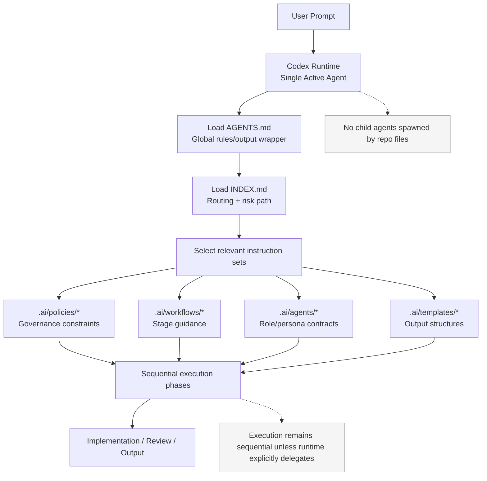
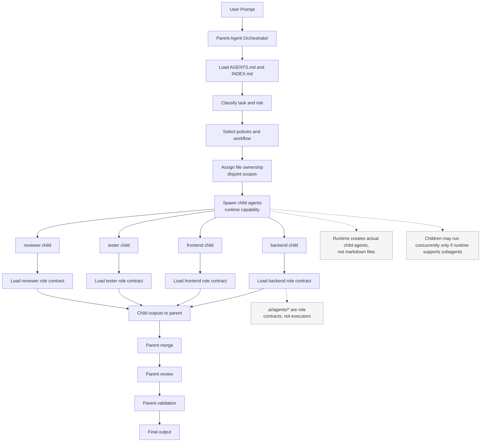

# Runtime Capability Report and Workflow Diagrams

## Executive Summary
- This repository is an instruction/workflow framework, not an executable multi-agent runtime by itself.
- In this Codex session, runtime subagent APIs are available, so true delegated parent/child execution is possible when explicitly invoked.
- Without runtime delegation APIs (or without explicit invocation), behavior is sequential single-agent execution using markdown instructions.

## Runtime Capability Verdict
1. Running as a single Codex agent right now: **Yes** (parent agent).
2. Using instruction files only: **Partly** (repo is instruction files; runtime also provides delegation APIs).
3. Can spawn real subagents in this runtime: **Yes**.
4. Did this request spawn subagents: **No**.
5. Can subagents run concurrently here: **Yes**, if spawned.
6. Can each subagent receive isolated context: **Yes**, runtime-managed per agent/thread.
7. Can each subagent use different role instructions: **Yes**, through per-agent prompts/contracts.
8. Can subagents report back to a parent agent: **Yes**, via runtime wait/report flow.
9. Is `.ai/agents/*` executed directly: **No**; they are read as instruction/context contracts.

## Repo Architecture Classification
- Classification: **E. Hybrid instruction/workflow framework**.
- Rationale: it combines role contracts, stage workflows, governance policies, and templates; these guide behavior but do not instantiate executable workers by themselves.

| Path | Type | Executable Agent? | Runtime Instruction? | Creates Parallel Worker? |
|---|---|---:|---:|---:|
| `AGENTS.md` | Global behavior contract | No | Yes | No |
| `INDEX.md` | Orchestration/routing guide | No | Yes | No |
| `.ai/agents/*` | Role playbooks | No | Yes | No |
| `.ai/workflows/*` | Sequential process definitions | No | Yes | No |
| `.ai/policies/*` | Governance constraints | No | Yes | No |
| `.ai/templates/*` | Output artifacts/scaffolds | No | Yes | No |
| `.ai/skills/*` | Reusable guidance modules | No | Yes | No |

## Current Repo Structure Summary
- Root instruction files: `AGENTS.md`
- Routing/index files: `INDEX.md`
- Agent/persona contract files: `.ai/agents/*.md`
- Workflow files: `.ai/workflows/*.md`
- Policy files: `.ai/policies/*.md`
- Template files: `.ai/templates/*.md`
- Runtime/orchestration docs: `docs/runtimes.md` (plus `docs/agents.md`, `docs/workflows.md`)

## Diagram 1: Current Sequential Setup


## Diagram 2: Proposed Delegated Parent/Child Setup


## Current vs Delegated Comparison
| Concern | Current Sequential Mode | Delegated Mode |
|---|---|---|
| Execution unit | One runtime agent/thread | Parent + runtime-spawned child agents |
| Uses `.ai/agents/*` as | Instruction/persona contracts for one agent | Role contracts for each child assignment |
| Parallelism | None by default | Possible if runtime supports concurrent subagents |
| Context isolation | Single shared context | Per-child context/thread (runtime-managed) |
| Merge risk | Lower (single writer path) | Higher; requires ownership boundaries + merge discipline |
| Runtime dependency | Low; any markdown-reading assistant | High; requires explicit subagent/delegation APIs |
| Best for | Small/medium scoped tasks | Larger multi-surface tasks with independent streams |
| Not ideal for | Large parallelizable efforts | Tiny tasks where orchestration overhead dominates |

## Recommended Terminology for Docs
1. Sequential mode: “Instruction-driven single-agent workflow.”
2. Delegated mode: “Runtime-orchestrated parent/child delegation.”
3. Repo does not do: “The repository does not itself spawn agents or provide process-level concurrency.”
4. Runtime dependency: “True child-agent execution and concurrency depend on runtime subagent APIs and explicit invocation.”

## Recommended Final Prompt (No-Subagent Runtimes)
```text
You are one Codex agent operating sequentially.

Execution contract:
1) Load AGENTS.md.
2) Load INDEX.md.
3) Load relevant .ai/policies/*.
4) Load selected .ai/workflows/* as sequential stage logic.
5) Load selected .ai/agents/* as role instructions (simulation only).
6) Load .ai/templates/* only when artifact output is required.

Behavior constraints:
- Do not claim parallel execution.
- Do not claim subagents unless runtime subagents were actually spawned.
- Treat .ai/agents/* as instruction profiles, not executable workers.
- Treat .ai/workflows/* as sequential process definitions.
- Make minimal, scoped, reversible changes.
- State what files were loaded and why.
- Run flow: ideation -> planning -> implementation -> review -> validation -> output.
- Enforce approvals/safety/quality/risk/DoD policies.
- Explicitly list assumptions, tradeoffs, risks, and test evidence.
```
