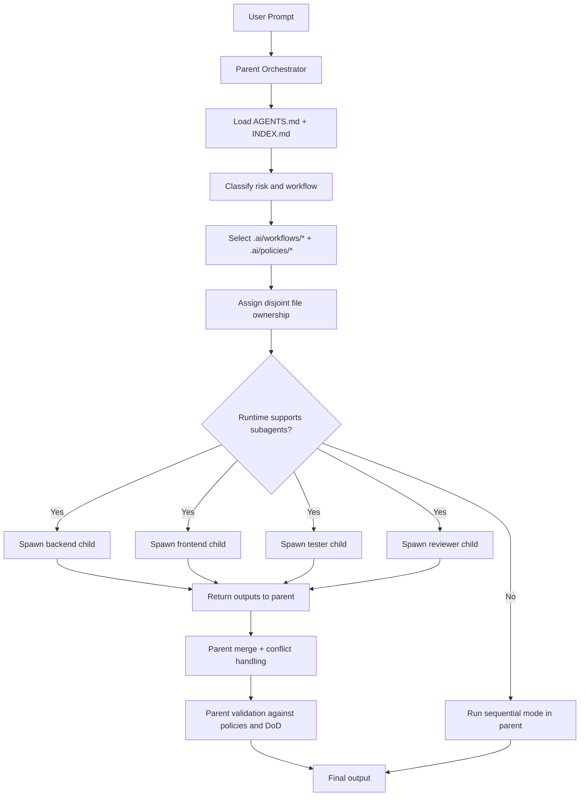

# Review Path to 3-Layer Execution Architecture

## 1. Executive summary
- Current state matches a 2-layer system (instructions + workflows) executed by external runtimes.
- The repo is close to a 3-layer architecture, but Execution Layer contracts are under-documented.
- Main risk is terminology drift: “agent” is used for role contracts and can be misread as executable workers.
- Recommended path: docs-first, additive, no renames initially, explicit execution-modes documentation, then optional delegation contracts.

## 2. Current layer mapping table

| Path | Current Purpose | Proposed Layer | Reason | Concern |
|---|---|---|---|---|
| `AGENTS.md` | Global runtime behavior wrapper | Workflow Layer | Defines execution structure and output contract | Also reads like global policy; mixed with governance references |
| `INDEX.md` | Entrypoint, risk routing, stage selection | Workflow Layer | Chooses path/agents/workflows by risk | Uses “agents” language without explicit execution semantics |
| `.ai/agents/*.md` | Role/persona contracts | Instruction Layer | Role responsibilities/constraints/output expectations | “Agent” term implies executable worker to some readers |
| `.ai/policies/*.md` | Governance controls | Instruction Layer | Approval, safety, quality, risk, DoD | None; clear category |
| `.ai/templates/*.md` | Artifact templates | Instruction Layer | Output scaffolds for specs/reviews/tests | None |
| `.ai/workflows/*.md` | Stage sequencing/handoffs/gates | Workflow Layer | Process order and gate behavior | “automatic progression” can be read as runtime automation |
| `.ai/skills/*` | Reusable guidance | Instruction Layer (optional extension) | Prompt guidance modules | Scope boundary vs workflows not fully explicit |
| `.ai/hooks/README.md` | Future automation placeholder | Unclear / cross-layer | Mentions automation, but no runtime implementation | Could be mistaken as active execution extension |
| `docs/runtimes.md` | Runtime-agnostic usage guidance | Execution Layer docs (conceptual) | Describes runtime consumption model | Missing explicit capability matrix + delegation caveats |
| `docs/agents.md` | Role catalog | Instruction Layer docs | Documents role contracts | Uses hierarchy language that may imply active orchestration |
| `docs/workflows.md` | Workflow docs | Workflow Layer docs | Documents progression and handoffs | “Workflows progress automatically” needs runtime qualifier |
| `docs/policies.md` | Policy docs | Instruction Layer docs | Governance explanation | None |
| `README.md` | Repository positioning and usage | Cross-layer | Introduces all layers | Contains wording like “workflow agents” and “multi-agent handoffs” that can over-imply execution |
| `examples/*` | Scenario references | Cross-layer (reference) | Demonstrates collaboration patterns | Must explicitly say conceptual unless runtime delegation is used |
| `codex.session` | Runtime/session artifact | Execution Layer (runtime artifact) | Execution-state file | Not portable architecture content |
| `report.md`, `runtime-capability-and-diagrams.md` | Analysis artifacts | Cross-layer docs | Explain capabilities and modes | Not yet integrated into canonical docs |

## 3. Gap analysis
- Missing docs:
  - No canonical `execution-modes` doc that defines sequential vs delegated vs future autonomous.
  - No runtime capability matrix by feature (subagents, parallelism, context isolation).
  - No parent-orchestrator contract doc for delegated mode.
- Unclear terminology:
  - “agent” used for role contract files and implied executors.
  - “automatic progression” used without “within one runtime agent unless delegation is invoked.”
- Mixed responsibilities:
  - `AGENTS.md` mixes response format, engineering standards, and governance references.
  - `INDEX.md` mixes routing, policy map, and “automation model”.
- Potentially incorrect runtime implications:
  - README phrase “multi-agent handoffs” can be interpreted as real concurrent workers.
  - Workflow docs imply automation without saying runtime-owned orchestration.
- Terms that need explicit distinction:
  - `role contract` (`.ai/agents/*`)
  - `workflow definition` (`.ai/workflows/*`)
  - `runtime executor` (Codex/Claude/etc.)
  - `subagent` (runtime-spawned child)
  - `parallel execution` (runtime capability, not repo capability)
  - `autonomous execution` (future extension, currently not implemented here)

## 4. Proposed target structure
- Keep current tree; add explicit execution docs.
- Recommended additions:
  - `docs/architecture.md` (3-layer model)
  - `docs/execution-modes.md` (sequential/delegated/autonomous-future)
  - `docs/runtime-capability-matrix.md` (capability-by-runtime table)
- Delegation docs location:
  - Prefer `docs/delegation/` for first iteration (clear docs-first, non-runtime-pretending).
  - Optional later mirror under `.ai/delegation/` if you want machine-consumable contracts.
- Suggested files (with naming tweak):
  - `docs/delegation/parent-orchestrator-contract.md`
  - `docs/delegation/child-role-contract-mapping.md`
  - `docs/delegation/file-ownership-strategy.md`
  - `docs/delegation/merge-and-validation-strategy.md`
- Why this naming:
  - Adds “contract/strategy” suffixes to prevent confusion with executable components.

## 5. Delegated mode design
- Parent orchestrator responsibilities:
  - Load `AGENTS.md` + `INDEX.md`.
  - Classify task risk/size.
  - Select workflow + policies.
  - Partition file ownership into disjoint scopes.
  - Spawn children only if runtime supports it.
  - Merge outputs, run review/validation, produce final answer.
- Child responsibilities:
  - Execute scoped tasks only.
  - Follow mapped role contract from `.ai/agents/*`.
  - Return evidence: changes, tests, assumptions, risks.
- Mapping `.ai/agents/*` to children:
  - `backend.md` -> backend child
  - `frontend.md` -> frontend child
  - `qa.md` -> tester child
  - `code-review.md` -> reviewer child
  - `security.md` optional security child for medium/high-risk surfaces
- Workflow selection:
  - Parent chooses `.ai/workflows/{feature|bugfix|refactor|release}.md` by intent/risk.
- File ownership:
  - Pre-allocate non-overlapping paths per child.
  - Parent blocks conflicting edits and reassigns if overlap occurs.
- Merge:
  - Parent integrates in order: contract-sensitive changes first, then implementation, then tests, then review remediations.
- Review/validation:
  - Reviewer child checks correctness/maintainability/security/perf risk.
  - Parent enforces `.ai/policies/*` gates and DoD before final output.
- Reject delegated mode when:
  - Task is tiny/single-file.
  - Work is tightly coupled with high merge conflict probability.
  - Runtime lacks reliable subagent support/context isolation.
  - Governance-critical steps need single-threaded traceability.

## 6. Runtime capability matrix format

| Runtime | Reads Markdown Instructions | Sequential Workflow | Subagent Support | Parallel Execution | Context Isolation | Notes |
|---|---:|---:|---:|---:|---:|---|
| Codex | Yes | Yes | Yes (runtime-dependent by tool availability) | Yes (if subagents spawned) | Yes (per-agent thread/context) | Confirm per runtime version/session tools |
| Claude Code | Yes | Yes | Unknown / runtime-dependent | Unknown / runtime-dependent | Unknown / runtime-dependent | Validate against current feature set/version |
| Cursor | Yes | Yes | Unknown / runtime-dependent | Unknown / runtime-dependent | Unknown / runtime-dependent | Often instruction-driven unless explicit agent features enabled |
| Cline | Yes | Yes | Unknown / runtime-dependent | Unknown / runtime-dependent | Unknown / runtime-dependent | Treat as sequential by default |
| Roo Code | Yes | Yes | Unknown / runtime-dependent | Unknown / runtime-dependent | Unknown / runtime-dependent | Treat as sequential by default |
| Generic Chat UI | Usually yes (paste/upload dependent) | Partial | No / unknown | No / unknown | No / unknown | No reliable file-system/tool orchestration guarantees |

## 7. README/docs wording
- Exact wording to use:
  - “This repository is an instruction and workflow library. It is not an execution runtime.”
  - “Files in `.ai/agents/*` are role contracts; they do not spawn runnable agents by themselves.”
  - “Default portable mode is sequential single-agent execution.”
  - “Delegated parent/child execution is optional and requires runtime support for subagents plus explicit orchestration.”
  - “Autonomous multi-step execution is a future extension, not current repository behavior.”
- Wording to avoid:
  - “Built-in multi-agent execution.”
  - “Agents run concurrently out of the box.”
  - “`.ai/agents/*` creates workers.”
  - “Autonomous runtime included.”

## 8. Migration plan

### Phase 1 — Clarify terminology
- Files to add/update:
  - Update README terminology sections.
  - Add glossary block in `docs/README.md` or new `docs/architecture.md`.
- Reason:
  - Remove role-contract vs runtime confusion.
- Risk:
  - Low.
- Acceptance criteria:
  - No doc line implies markdown files execute agents.

### Phase 2 — Add execution mode docs
- Files to add:
  - `docs/execution-modes.md`
- Reason:
  - Define sequential, delegated, autonomous-future explicitly.
- Risk:
  - Low.
- Acceptance criteria:
  - Each mode has trigger conditions, limits, and ownership model.

### Phase 3 — Add delegation contracts
- Files to add:
  - `docs/delegation/parent-orchestrator-contract.md`
  - `docs/delegation/child-role-contract-mapping.md`
  - `docs/delegation/file-ownership-strategy.md`
  - `docs/delegation/merge-and-validation-strategy.md`
- Reason:
  - Make delegated mode operationally precise.
- Risk:
  - Medium (could overfit one runtime).
- Acceptance criteria:
  - Delegation docs explicitly state runtime dependency and fallback path.

### Phase 4 — Add runtime matrix
- Files to add:
  - `docs/runtime-capability-matrix.md`
- Reason:
  - Capability-based comparison avoids marketing claims.
- Risk:
  - Medium (staleness).
- Acceptance criteria:
  - Unknowns clearly marked; date/version fields included.

### Phase 5 — Add parent orchestration prompt
- Files to add:
  - `docs/prompts/parent-orchestrator.md`
  - `docs/prompts/sequential-fallback.md`
- Reason:
  - Provide reproducible execution contracts.
- Risk:
  - Low.
- Acceptance criteria:
  - Prompts forbid false subagent/parallel claims.

### Phase 6 — Validate with Codex
- Files to update:
  - `docs/use-cases.md` with observed run patterns.
- Reason:
  - Ground docs in actual behavior.
- Risk:
  - Medium (runtime features change).
- Acceptance criteria:
  - At least one sequential and one delegated runbook with evidence and caveats.

## 9. Final recommendations
1. Should this be implemented as docs only first? **Yes**.
2. Should `.ai/agents/*` be renamed? **No immediate rename**. Keep stable paths; add explicit “role contract” terminology everywhere. Consider rename only in major version.
3. Should delegation live under `.ai/delegation/` or `.ai/workflows/delegated-*`? **`docs/delegation/` first**. Add `.ai/delegation/` later only if you need prompt-consumable machine-oriented contracts.
4. Should README call this a multi-agent framework? **Not as a blanket claim**. Use “instruction/workflow framework with optional runtime-dependent delegated mode.”
5. Best final positioning statement:
   - “`ai-agents` is a runtime-agnostic instruction/workflow framework for AI coding assistants, with portable sequential execution by default and optional delegated parent/child orchestration when the runtime explicitly supports subagents.”
